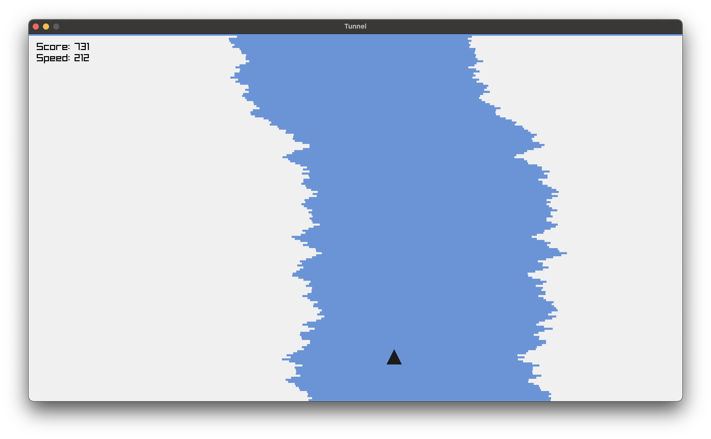
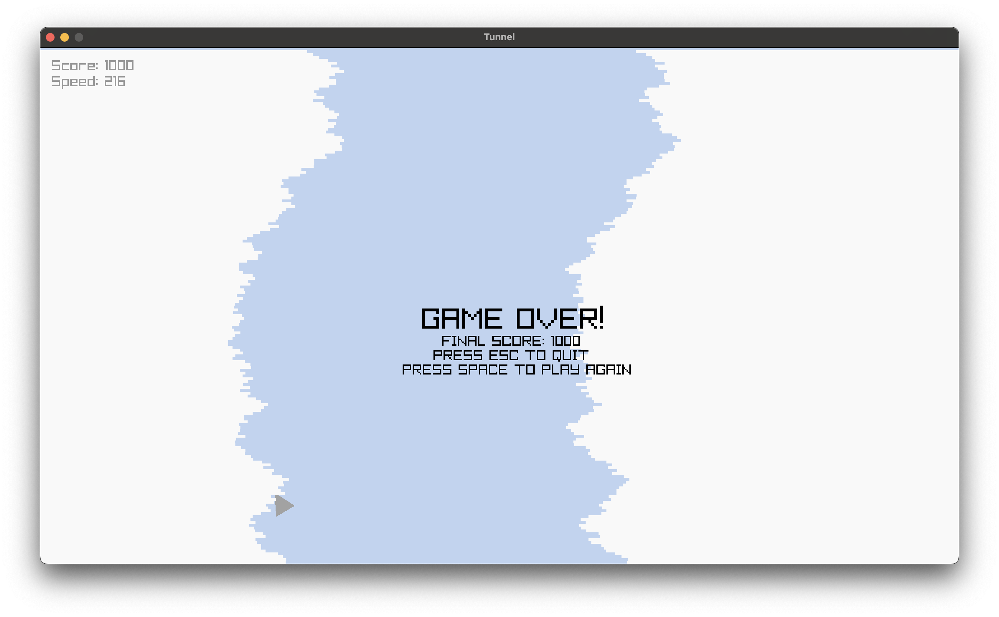

# Tunnel

A simple game written in Zig using Raylib.

The goal is to avoid the walls of the tunnel as you speed faster and faster.





The game was written using Zig version `0.14.0-dev.2577+271452d22`.

To play the game, clone this repository and run:

```bash
zig build -Doptimize=ReleaseFast run
```
